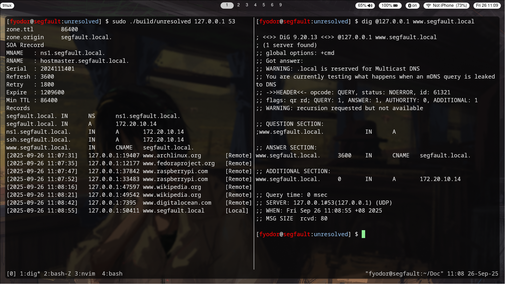

# Unresolved
*A lightweight DNS resolver written in C*

## Description
**Unresolved** is a lightweight DNS resolver written in C. It  resolves local domains defined in the zone file and forwards unknown queries to an external resolver. This server can only run on Linux systems.



## How it Works

1. The server loads the zone file under the `config/` directory at startup.

2. When a DNS client sends a request to the server
	- the server responds with the appropriate response if the domain is defined.
	- the server will forward the request to the external DNS resolver and relay the response back to the client if the domain is not found.


```                 
 +------------+ -----(request)--> +------------+                     +------------------+
 | DNS Client |                   | Unresolved | -----(forward)----> | External Resolver|
 +------------+ <---(response)--- +------------+                     +------------------+
       ^                              |                                    |
       |                              |                                    v
       |<------------(relay)----------|<-----------(response)--------------+
```


## Installation
Clone this repository and compile the code.
```bash
git clone https://github.com/thihahtoozin/unresolved.git
cd unresolved
make build/unresolved
```
Run the server.
```bash
./build/unresolved <ip> <udp:port>
```
Example:
```bash
./build/unresolved 127.0.0.1 5353
```

## Configuration
### Editing the Zone File
**Unresolved** uses a zone file to define local domains. You can edit the file under the `config/` directory to customize your DNS zones.

```zone
$TTL 86400 ;
$ORIGIN segfault.home. ;
@   IN  SOA     ns1.segfault.home. hostmaster.segfault.home. (
            2024111401   ; Serial
            3600         ; Refresh
            1800         ; Retry
            1209600      ; Expire
            86400 )      ; Minimum TTL
@   IN  NS      ns1.segfault.home.
@   IN  A       172.20.10.14

ns1 IN  A       172.20.10.14      ; Replace with your server IP
ssh IN	A	    172.20.10.14      ; SSH Server

www IN  CNAME   segfault.home.   ; www is an alias of the root domain

```

Modify the IP address and the domain name to your needs, or you can copy the file contents and paste them to your desired file location, then edit the address information.
Then you change the path in the `include/config.h` file.

```c
#define ZONE_FILE "config/zones/segfault.home.zone"     // Edit this line for changing the zone file path
#define EXT_SERV "8.8.8.8"                              // Edit this line for changing external server IP
#define EXT_SERV_PORT 53                                // Edit this line for changing external server PORT 
```
Here you can also change the address of external DNS resolver.

> Note : After editing the zone file, restart the program to apply changes.

## System DNS Client Setup

### Linux `systemd-resolved`
Tell `systemd-resolved` to use the local DNS server for all queries.
```
sudo resolvectl dns wlan0 127.0.0.1
sudo resolvectl domain wlan0 "~."
```

Replace `wlan0` with your network interface. (use `ip link` to list your interfaces)

Flush the caches.
```
sudo resolvectl flush-caches
```

### Windows
1. Go to Control Panel → Network and Sharing Center → Change adapter settings.
2. Right click your network → Properties.
3. Select Internet Protocol Version 4 (TCP/IPv4) → Properties.
4. Choose “Use the DNS server addresses”.

## Examples Queries

Start the server
```bash
./build/unresolved 127.0.0.1 5353
```

Query local domains:
```bash
dig @127.0.0.1 -p 5353 segfault.home
dig @127.0.0.1 -p 5353 segfault.home NS
dig @127.0.0.1 -p 5353 www.segfault.home
```

Query external domains:
```bash
dig @127.0.0.1 -p 5353 www.archlinux.org
dig @127.0.0.1 -p 5353 www.raspberrypi.com
```

## Uninstallation
To remove **Unresolved** from your system, follow these steps:

### Linux
Terminate the server
```
pkill unresolved
```

Restore DNS settings (you do not need if you didn't follow the **System DNS Client Setup** section)
```
sudo resolvectl revert wlan0              # replace wlan0 with your network interface
sudo resolvectl flush-caches
sudo systemctl restart systemd-resolved
```

### Windows
1. Go to Control Panel → Network and Sharing Center → Change adapter settings.
2. Right-click your network → Properties.
3. Select Internet Protocol Version 4 (TCP/IPv4) → Properties.
4. Set “Obtain DNS server address automatically”.

